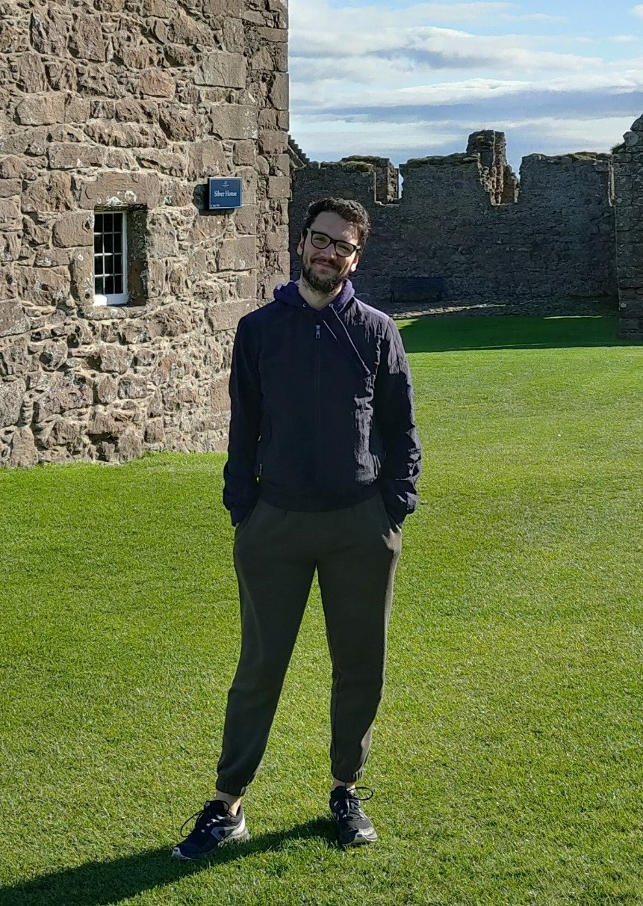

{:style="float: right; margin: 0px 20px; width: 35%;"}

I'm a **Ph.D. student** at the University of Glasgow supervised by [Jeff Dalton](https://www.dcs.gla.ac.uk/~jeff/){:target="_blank"}

I was part of the winning team that won the [2021-2022 Amazon Alexa Prize TaskBot Challenge](https://www.amazon.science/alexa-prize/taskbot-challenge/2021){:target="_blank"}.

My work focuses on using **Multi-Modal** information to improve on **Music Information Retrieval** tasks, trying to inject world knowledge into them. I explore how Music systems can learn about world knowledge, exploiting Multi-Modal content to improve their capabilities to solve music tasks. 

I apply my research to Music Information Retrieval tasks, using contrastive learning to try to teach them multi-modal world knowledge.

Timeline:

__2023__
* [Upcoming] Practical Session for the Conversational Information Seekeing Tutorial at [WWW2023](https://www2023.thewebconf.org/program/tutorials/){:target="_blank"}
* GRILL Team gets accepted as one of the 10 competitors in the Alexa Prize Taskbot Challenge Year 2 [*Article*](https://www.amazon.science/alexa-prize/taskbot-challenge/ten-university-teams-selected-for-alexa-prize-taskbot-challenge-2){:target="_blank"}

__2022__
* GRILL Team won the **Alexa Prize TaskBot Challenge** [*Article*](https://grilllab.ai/2022-05-15-alexa_taskbot_win/){:target="_blank"} [**Paper**](https://www.amazon.science/alexa-prize/proceedings/grillbot-a-flexible-conversational-agent-for-solving-complex-real-world-tasks){:target="_blank"}
* Practical Session for the Conversational Information Seekeing Tutorial at [SIGIR2022](https://sigir.org/sigir2022/program/tutorials/#Conversational){:target="_blank"}
* Publication at **SIGDIAL** (Demo Paper): GRILLBot: A multi-modal conversational agent for complex real-world tasks [**Paper**](https://aclanthology.org/2022.sigdial-1.63.pdf){:target="_blank"}
* Invited Workshops at Stanford University and University of South California

__2021__
* GRILL Team gets accepted as one of the 10 competitors in the Alexa Prize Tasbot Challenge Year 1 [*Article*](https://www.amazon.science/academic-engagements/ten-university-teams-selected-to-participate-in-alexa-prize-taskbot-challenge){:target="_blank"}

__2020__
* Publication at **SIGIR** (Short-Paper): Relevance Transformer: Generating Concise Code Snippets with Relevance Feedback [**Paper**](https://arxiv.org/pdf/2007.02609.pdf){:target="_blank"}

__2019__
* Publication at **Clic-IT**: A comparative Study of Models for Answer Sentence Selection [**Paper**](https://ceur-ws.org/Vol-2481/paper64.pdf){:target="_blank"}
* Started PhD in Computing Science at University of Glasgow under Jeff Dalton

__2018__
* Won with my team the **Fujitsu AI NLP Challenge** [*Article*](https://www.technology.org/2018/05/02/fujitsu-ai-nlp-challenge/){:target="_blank"} [**Paper**](https://ceur-ws.org/Vol-2244/paper_05.pdf){:target="_blank"}
* Publication at **NL4AI** (Workshop): Cross-Attention for Selection-based Question Answering [**Paper**](https://ceur-ws.org/Vol-2244/paper_05.pdf){:target="_blank"}

